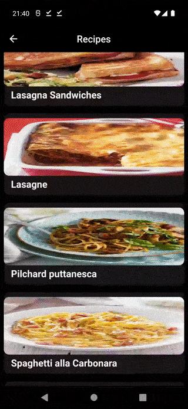
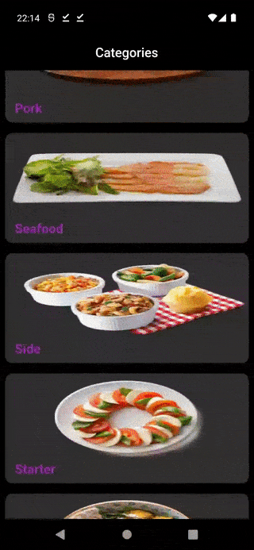
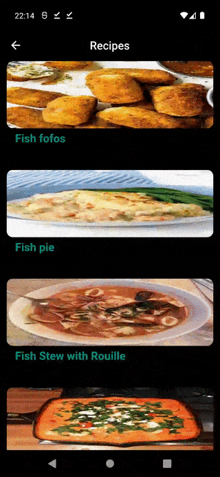
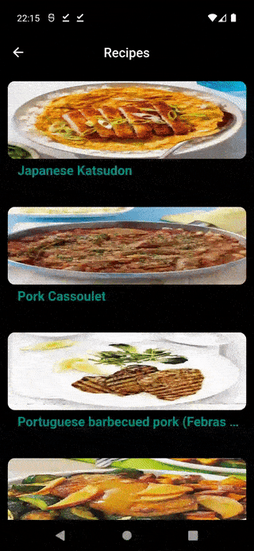

# MEAL APP with MVVM and Provider

This Flutter app provides different recipes to the user with a remote api. In this project, which was built with MVVM architecture, the Provider package was used for state management.

<h3 align="left">Screenshots</h3>

 
 
   
  
 
 
   
  
  
